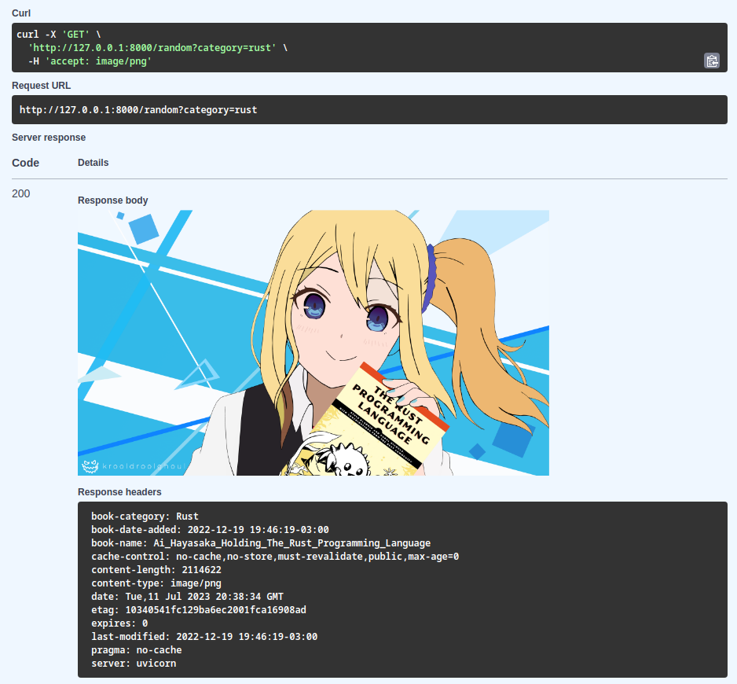

<div align="center">

  # 📚 AGHPB API

  <sub>Behold the **anime girls holding programming books** API!</sub>

  [](https://hub.docker.com/r/devgoldy/aghpb_api "We're on docker!")

</div>

This is an API I made for the anime girls holding programming books [github repo](https://github.com/cat-milk/Anime-Girls-Holding-Programming-Books) because I was bored.
It's a rewrite of the [old API](https://github.com/THEGOLDENPRO/aghpb_api_legacy) but written in Python using the [Fast API](https://github.com/tiangolo/fastapi) library instead.
It scraps a local copy of the repo and thanks to that I was able to implement headers like ``Book-Date-Added`` (returns the date and time a book was added).



<br>

If you are cloning this repo to run it for yourself you'll probably want to pull the submodule too.
```sh
git submodule update --init --recursive
```
> It pulls down the anime girls holding programming books [github repo](https://github.com/cat-milk/Anime-Girls-Holding-Programming-Books).

## 💫 API Wrappers
I was also even more bored so I decided to write an API wrapper in every mfing language I can possible, including those I've never really written in.

These are the languages I've written so far:
- **🦀 Rust - [``aghpb.rs``](https://github.com/THEGOLDENPRO/aghpb.rs)**
- **🟦 TypeScript - [``aghpb.ts``](https://github.com/THEGOLDENPRO/aghpb.ts)**
- **⚫ C - [``aghpb.c``](https://github.com/THEGOLDENPRO/aghpb.c)** (not async, ~~might blow up~~)
- **🔥 Mojo - ``Soon™``**
- **🔵 Go - ``Soon™``**
- **🌕 Lua - [``aghpb.lua``](https://github.com/THEGOLDENPRO/aghpb.lua)** (not async)
- ~~**☕ Java** - ``Soon™``~~ *"fuck you java (maven included)"*

## Publicly available AGHPB API instances
> ### ```🇬🇧``` https://api.devgoldy.xyz/aghpb/v1 ```hosted by``` [THEGOLDENPRO](https://github.com/THEGOLDENPRO)
> ### ```🇩🇪``` https://api.r3tr0ananas.pro/aghpb/v1 ```hosted by``` [r3tr0ananas](https://github.com/r3tr0ananas)
