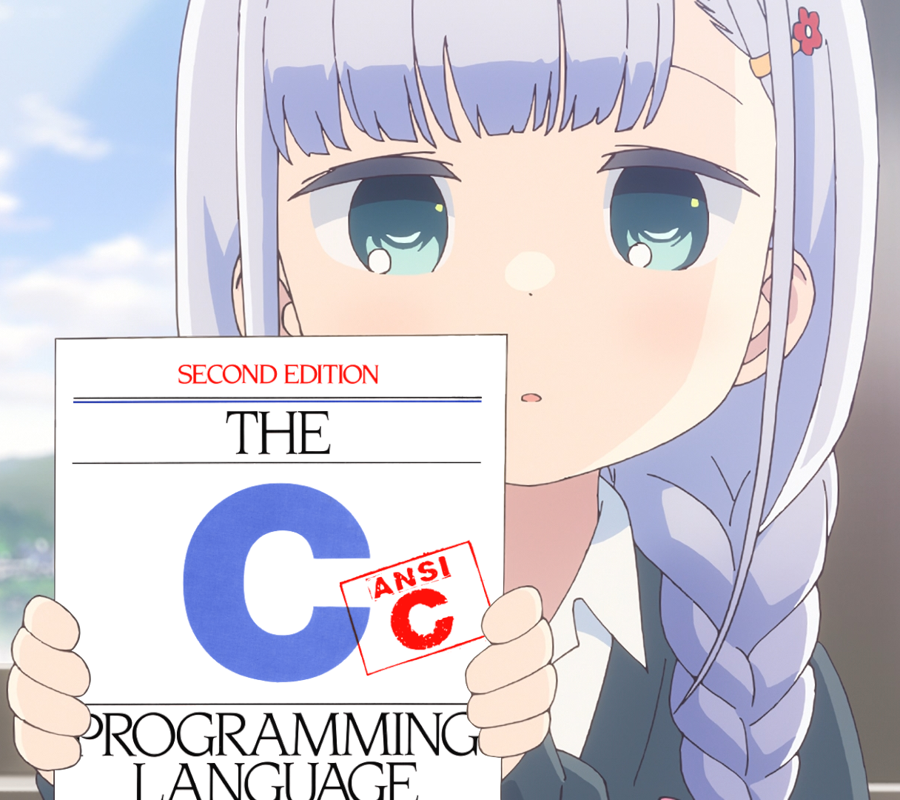

<div align="center">

  # 📚 AGHPB API

  

  <sub>Behold the **anime girls holding programming books** API!</sub>

</div>

This is an open API I made for the anime girls holding programming books [github repo](https://github.com/cat-milk/Anime-Girls-Holding-Programming-Books) because I was bored.

It's a rewrite of the [old API](https://github.com/THEGOLDENPRO/aghpb_api) written in Python using the [Fast API](https://github.com/tiangolo/fastapi) library.

> ### You can catch the api at https://api.devgoldy.xyz/aghpb/v1
> *(When it's up of course)* 🫠

If you are cloning this repo you'll probably want to pull the submodule too.
```sh
git submodule update --init --recursive
```
It pulls down the anime girls holding programming books [github repo](https://github.com/cat-milk/Anime-Girls-Holding-Programming-Books).
